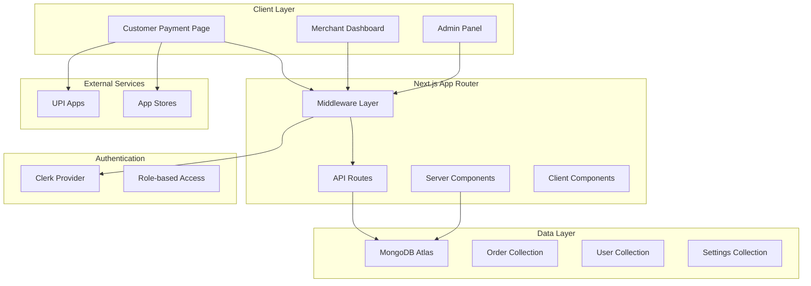

# Design Document

## Overview

The UPI Payment System is a comprehensive Next.js application built with App Router architecture that enables merchants to create and manage UPI payment links while providing customers with a seamless payment experience. The system integrates Clerk for authentication, MongoDB for data persistence, and supports multiple UPI applications with manual verification workflows.

### Key Design Principles

- **Security First**: All routes protected with Clerk authentication and role-based access control
- **Mobile-First**: Responsive design optimized for mobile UPI app interactions
- **Scalable Architecture**: Modular design supporting future enhancements
- **Developer Experience**: TypeScript throughout with comprehensive error handling

## Architecture

### High-Level Architecture



### Technology Stack Integration

- **Frontend**: Next.js 15 App Router + React 19 + TypeScript
- **Styling**: TailwindCSS v4 + ShadCN UI components
- **Authentication**: Clerk with role-based middleware
- **Database**: MongoDB with Mongoose ODM
- **State Management**: React Server Components + Client-side hooks
- **Notifications**: SweetAlert2 for user feedback

## Components and Interfaces

### Core Data Models

#### Order Model
```typescript
interface Order {
  _id: ObjectId
  orderId: string // Unique identifier
  amount: number
  merchantName: string
  vpa: string // UPI ID
  status: 'pending' | 'pending-verification' | 'completed' | 'expired' | 'failed'
  utr?: string // UTR number submitted by customer
  createdBy: string // Clerk user ID
  createdAt: Date
  expiresAt: Date
  paymentPageUrl: string
  upiDeepLink: string
}
```

#### User Model (Clerk Integration)
```typescript
interface ClerkUser {
  id: string
  emailAddress: string
  firstName?: string
  lastName?: string
  publicMetadata: {
    role: 'admin' | 'merchant' | 'viewer'
    onboardingComplete?: boolean
  }
}
```

#### System Settings Model
```typescript
interface SystemSettings {
  _id: ObjectId
  timerDuration: number // in minutes, default 9
  staticUpiId?: string // for manual UPI mode
  enabledUpiApps: {
    gpay: boolean
    phonepe: boolean
    paytm: boolean
    bhim: boolean
  }
  updatedBy: string
  updatedAt: Date
}
```

### API Interface Design

#### Order Management APIs
```typescript
// POST /api/orders
interface CreateOrderRequest {
  amount: number
  vpa: string
  merchantName: string
}

interface CreateOrderResponse {
  orderId: string
  payPageUrl: string
  upiLink: string
}

// GET /api/orders/:orderId
interface OrderDetailsResponse {
  order: Order
  timeRemaining: number // in seconds
}

// POST /api/orders/:orderId/utr
interface SubmitUTRRequest {
  utr: string
}

interface SubmitUTRResponse {
  message: string
  status: string
}
```

#### Admin APIs
```typescript
// POST /api/admin/users
interface CreateUserRequest {
  email: string
  firstName: string
  lastName: string
  role: 'admin' | 'merchant' | 'viewer'
}

// GET /api/admin/stats
interface AdminStatsResponse {
  totalOrders: number
  ordersByStatus: Record<string, number>
  userStats: Array<{
    userId: string
    userName: string
    totalLinks: number
    successfulOrders: number
  }>
  recentActivity: Array<{
    orderId: string
    action: string
    timestamp: Date
    userId: string
  }>
}
```

### Component Architecture

#### Page Components (Server Components)
- `app/page.tsx` - Landing/Dashboard page
- `app/pay/[orderId]/page.tsx` - Payment page
- `app/admin/page.tsx` - Admin dashboard
- `app/dashboard/page.tsx` - Merchant dashboard

#### Shared Components
```typescript
// Payment Page Components
interface PaymentPageProps {
  order: Order
  settings: SystemSettings
}

interface UPIButtonProps {
  app: 'gpay' | 'phonepe' | 'paytm' | 'bhim'
  upiLink: string
  enabled: boolean
}

interface CountdownTimerProps {
  expiresAt: Date
  onExpire: () => void
}

// Admin Components
interface OrderTableProps {
  orders: Order[]
  onStatusUpdate: (orderId: string, status: string) => void
}

interface UserManagementProps {
  users: ClerkUser[]
  onCreateUser: (userData: CreateUserRequest) => void
  onDeleteUser: (userId: string) => void
}
```

## Data Models

### Database Schema Design

#### Orders Collection
```javascript
{
  _id: ObjectId,
  orderId: String, // indexed, unique
  amount: Number,
  merchantName: String,
  vpa: String,
  status: String, // enum: pending, pending-verification, completed, expired, failed
  utr: String, // optional
  createdBy: String, // Clerk user ID, indexed
  createdAt: Date,
  expiresAt: Date, // indexed for cleanup
  paymentPageUrl: String,
  upiDeepLink: String,
  metadata: {
    customerIP: String,
    userAgent: String,
    referrer: String
  }
}
```

#### System Settings Collection
```javascript
{
  _id: ObjectId,
  timerDuration: Number, // default 9 minutes
  staticUpiId: String, // optional
  enabledUpiApps: {
    gpay: Boolean,
    phonepe: Boolean,
    paytm: Boolean,
    bhim: Boolean
  },
  updatedBy: String,
  updatedAt: Date
}
```

#### Audit Logs Collection
```javascript
{
  _id: ObjectId,
  action: String, // order_created, utr_submitted, status_updated, user_created, etc.
  entityType: String, // order, user, settings
  entityId: String,
  userId: String, // Clerk user ID
  details: Object, // action-specific data
  timestamp: Date,
  ipAddress: String
}
```

### Data Relationships

- **Orders** belong to **Users** (via createdBy field)
- **Audit Logs** track changes to **Orders**, **Users**, and **Settings**
- **System Settings** are global and versioned

## Error Handling

### Error Classification

#### Client-Side Errors
```typescript
interface ClientError {
  type: 'validation' | 'network' | 'timeout' | 'user_action'
  message: string
  code?: string
  retryable: boolean
}
```

#### Server-Side Errors
```typescript
interface ServerError {
  type: 'authentication' | 'authorization' | 'database' | 'external_service' | 'validation'
  message: string
  statusCode: number
  details?: any
}
```

### Error Handling Strategy

#### API Route Error Handling
```typescript
// Centralized error handler
export function handleAPIError(error: unknown): NextResponse {
  if (error instanceof ValidationError) {
    return NextResponse.json(
      { error: 'Validation failed', details: error.details },
      { status: 400 }
    )
  }
  
  if (error instanceof AuthenticationError) {
    return NextResponse.json(
      { error: 'Authentication required' },
      { status: 401 }
    )
  }
  
  // Log unexpected errors
  console.error('Unexpected API error:', error)
  return NextResponse.json(
    { error: 'Internal server error' },
    { status: 500 }
  )
}
```

#### Client-Side Error Boundaries
```typescript
interface ErrorBoundaryState {
  hasError: boolean
  error?: Error
}

class PaymentErrorBoundary extends Component<Props, ErrorBoundaryState> {
  // Handle payment-specific errors with retry mechanisms
}
```

### UPI Deep Link Fallback Strategy

```typescript
const handleUPIRedirect = async (app: string, upiLink: string) => {
  try {
    // Attempt to open UPI app
    window.location.href = upiLink
    
    // Fallback to app store after timeout
    setTimeout(() => {
      const storeLinks = {
        gpay: 'https://play.google.com/store/apps/details?id=com.google.android.apps.nbu.paisa.user',
        phonepe: 'https://play.google.com/store/apps/details?id=com.phonepe.app',
        paytm: 'https://play.google.com/store/apps/details?id=net.one97.paytm',
        bhim: 'https://play.google.com/store/apps/details?id=in.org.npci.upiapp'
      }
      
      window.open(storeLinks[app], '_blank')
    }, 3000)
  } catch (error) {
    // Handle error and show manual UPI option
    showManualUPIOption()
  }
}
```

## Testing Strategy

### Unit Testing
- **API Routes**: Test all endpoints with various input scenarios
- **Utility Functions**: UPI link generation, validation, timer logic
- **Database Models**: CRUD operations and data validation

### Integration Testing
- **Authentication Flow**: Clerk integration with role-based access
- **Payment Flow**: End-to-end order creation to UTR submission
- **Admin Operations**: User management and system configuration

### End-to-End Testing
- **Customer Journey**: Payment page interaction and UPI app redirection
- **Merchant Workflow**: Order creation and management
- **Admin Tasks**: User creation, order verification, system settings

### Testing Tools
```typescript
// Jest configuration for API testing
describe('Order API', () => {
  test('creates order with valid data', async () => {
    const response = await POST('/api/orders', validOrderData)
    expect(response.status).toBe(201)
    expect(response.body).toHaveProperty('orderId')
  })
})

// Playwright for E2E testing
test('customer can submit UTR', async ({ page }) => {
  await page.goto('/pay/test-order-id')
  await page.fill('[data-testid="utr-input"]', '123456789012')
  await page.click('[data-testid="submit-utr"]')
  await expect(page.locator('[data-testid="success-message"]')).toBeVisible()
})
```

### Security Testing
- **Authentication Bypass**: Attempt to access protected routes
- **Authorization Escalation**: Test role-based access controls
- **Input Validation**: SQL injection, XSS, and data validation
- **Rate Limiting**: API endpoint abuse prevention

## Performance Considerations

### Optimization Strategies

#### Database Optimization
- **Indexing**: orderId, createdBy, expiresAt, status fields
- **Connection Pooling**: MongoDB connection management
- **Query Optimization**: Aggregation pipelines for analytics

#### Caching Strategy
```typescript
// Redis caching for system settings
const getSystemSettings = async (): Promise<SystemSettings> => {
  const cached = await redis.get('system:settings')
  if (cached) return JSON.parse(cached)
  
  const settings = await db.settings.findOne()
  await redis.setex('system:settings', 300, JSON.stringify(settings))
  return settings
}
```

#### Client-Side Performance
- **Code Splitting**: Route-based lazy loading
- **Image Optimization**: Next.js Image component
- **Bundle Analysis**: Webpack bundle analyzer integration

### Monitoring and Analytics

#### Performance Metrics
- **API Response Times**: Track endpoint performance
- **Database Query Performance**: Monitor slow queries
- **User Experience Metrics**: Core Web Vitals tracking

#### Business Metrics
- **Conversion Rates**: Payment completion statistics
- **User Engagement**: Dashboard usage analytics
- **System Health**: Error rates and uptime monitoring

## Security Architecture

### Authentication & Authorization

#### Clerk Integration
```typescript
// Middleware configuration
export default clerkMiddleware(async (auth, req) => {
  const { userId, sessionClaims } = await auth()
  
  // Admin route protection
  if (isAdminRoute(req)) {
    if (sessionClaims?.metadata?.role !== 'admin') {
      return NextResponse.redirect(new URL('/', req.url))
    }
  }
  
  // API route protection
  if (isAPIRoute(req) && !userId) {
    return NextResponse.json({ error: 'Unauthorized' }, { status: 401 })
  }
})
```

#### Role-Based Access Control
```typescript
const rolePermissions = {
  admin: ['create_user', 'delete_user', 'view_all_orders', 'update_settings'],
  merchant: ['create_order', 'view_own_orders'],
  viewer: ['view_assigned_orders']
}

const hasPermission = (userRole: string, permission: string): boolean => {
  return rolePermissions[userRole]?.includes(permission) || false
}
```

### Data Security

#### Input Validation
```typescript
const orderValidationSchema = z.object({
  amount: z.number().min(1).max(100000),
  vpa: z.string().regex(/^[\w.-]+@[\w.-]+$/),
  merchantName: z.string().min(1).max(100)
})
```

#### Data Encryption
- **In Transit**: HTTPS/TLS for all communications
- **At Rest**: MongoDB encryption at rest
- **Sensitive Data**: UTR numbers and payment details encrypted

### Compliance & Audit

#### Audit Logging
```typescript
const logAuditEvent = async (
  action: string,
  entityType: string,
  entityId: string,
  userId: string,
  details: any
) => {
  await db.auditLogs.create({
    action,
    entityType,
    entityId,
    userId,
    details,
    timestamp: new Date(),
    ipAddress: getClientIP()
  })
}
```

#### GDPR Compliance
- **Data Minimization**: Collect only necessary payment data
- **Right to Deletion**: User data removal capabilities
- **Data Portability**: Export user data functionality
- **Consent Management**: Clear privacy policy and consent flows